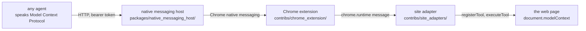
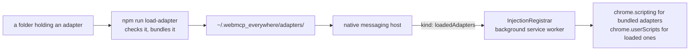
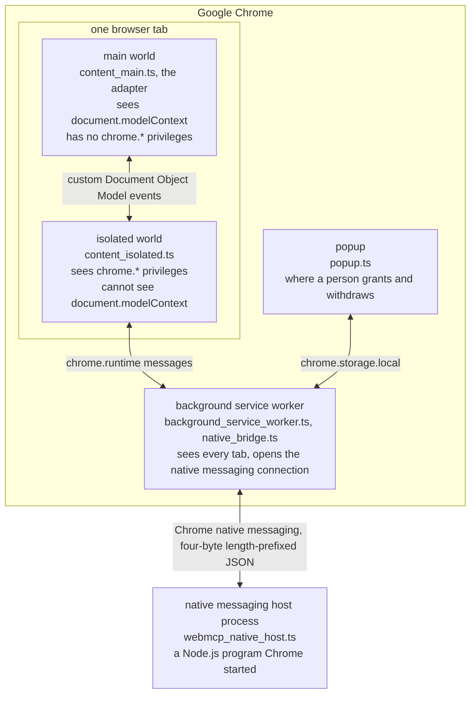

# The architecture of WebMCP Everywhere

WebMCP Everywhere gives an agent real tools on sites that never shipped their own. A site adapter registers tools into a page through the WebMCP browser interface, `document.modelContext`. A Chrome extension carries the adapters and decides what an agent is allowed to call. A native messaging host holds an HTTP port and serves Model Context Protocol to any agent. The agent is anything that speaks Model Context Protocol.

## The four parts

- **The site adapter** knows one site. It reads that site's pages and drives them, and it exposes what it can do as a list of tools. It is ordinary TypeScript, it runs inside the page, and it reaches nothing but that page. The adapters this build ships have one folder each under [`contribs/site_adapters/`](https://github.com/jeromeetienne/webmcp_everywhere/tree/main/contribs/site_adapters), and an adapter written by anybody else lives in a folder of its own outside this repository — see [write_a_site_adapter.md](write_a_site_adapter.md).
- **The Chrome extension** is a Manifest Version 3 extension. It carries every adapter this build was made with, it decides which adapter's scripts are registered for which sites, it holds the user's decision about what an agent may do on each origin, and it is the only part that knows which tabs currently have adapters running. It lives in [`contribs/chrome_extension/`](https://github.com/jeromeetienne/webmcp_everywhere/tree/main/contribs/chrome_extension).
- **The native messaging host** is an ordinary Node.js program on your machine. Chrome starts it as a child process when the extension asks for it. It holds the HTTP port that the extension itself cannot hold, it serves the extension's tools over Model Context Protocol, and it reads the folder of adapters loaded from outside this repository and reports them to the extension. It lives in [`packages/native_messaging_host/`](https://github.com/jeromeetienne/webmcp_everywhere/tree/main/packages/native_messaging_host).
- **The agent** is whatever you point at the endpoint. Codex and the Model Context Protocol Inspector are the two used while building this.

## Why each part exists

**The site adapter exists because most sites have not shipped WebMCP tools.** A site that has shipped its own is better served by its own: every adapter sets a `yieldCondition`, and an adapter stands down and registers nothing when the site already speaks WebMCP for itself. Long-term success for this project is a shrinking adapter count, not a growing one.

**The extension exists because an adapter has to reach `document.modelContext`, and because somebody has to enforce a decision the user made.** `document.modelContext` exists only in a page's main world, so the code that registers a tool has to run there, and code running there has no extension privileges at all. The extension is also the only place that knows the full picture: which tabs are open, which of them an adapter covers, and what the user has allowed on each origin.

**The native messaging host exists because a Chrome extension cannot listen on a port.** That is the whole reason, and it is measured rather than assumed — see [why_a_native_messaging_host.md](why_a_native_messaging_host.md). Something native has to hold the socket, and Chrome starts that program itself, so nothing needs launching by hand. It reads the loaded adapters as well, because a folder on disk is something a Node.js program can read and an extension cannot.

## Which adapter runs where, and who decides it

The manifest names no site. `InjectionRegistrar`, in the background service worker, works out which adapters the user has switched on, which sites those adapters cover, and tells Chrome to register their scripts for exactly those sites. It runs when the service worker starts, whenever extension storage changes, and whenever the native messaging host reports a different set of loaded adapters.

An adapter bundled into this build is registered with `chrome.scripting.registerContentScripts`, because its main-world code is part of the extension. An adapter loaded from a folder is registered with `chrome.userScripts`, because its code is not — that is the one interface Chrome offers for running code an extension did not ship, and it stays hidden until the user turns on **Allow User Scripts** for this extension.

This is what took the maintainer off the critical path: before it, every adapter needed a merge here and a rebuild of the extension. See [issue #9](https://github.com/jeromeetienne/webmcp_everywhere/issues/9).

## The execution contexts

Four separate execution contexts are involved, and none of them can reach into another one directly. Most of the design follows from this.

- The **main world** is the page's own JavaScript context. `document.modelContext` is visible only here, so the adapter itself runs here, along with the entry point that starts it: [`content_main.ts`](https://github.com/jeromeetienne/webmcp_everywhere/blob/main/contribs/chrome_extension/page_injection/content_main.ts) for a bundled adapter, [`external_adapter_main.ts`](https://github.com/jeromeetienne/webmcp_everywhere/blob/main/contribs/chrome_extension/page_injection/external_adapter_main.ts) for a loaded one. Both hand the same `MainWorldRuntime` a way to find the adapter for this page, so everything after that is one code path. Nothing here can touch `chrome.*`, so a grant has to arrive as a message.
- The **isolated world** is the ordinary content script context. Extension privileges are reachable here and `document.modelContext` is not. [`content_isolated.ts`](https://github.com/jeromeetienne/webmcp_everywhere/blob/main/contribs/chrome_extension/page_injection/content_isolated.ts) runs here and is the only bridge between the extension and the page. It sends plain data into the page — a grant, or a request naming a tool — never code, and it never takes instructions from the page.
- The **background service worker** sees every tab. It opens the native messaging connection and it aggregates the tools from every adapted tab into the one list an agent sees.
- The **native messaging host process** is not in the browser at all. Chrome started it and talks to it on standard input and standard output.

## What travels between them

| Boundary | Mechanism | What crosses |
| --- | --- | --- |
| agent → native messaging host | HTTP POST to `/mcp` with a bearer token | Model Context Protocol `tools/list` and `tools/call` |
| native messaging host → extension | Chrome native messaging, four-byte little-endian length followed by UTF-8 JSON | `{ id, kind: 'listTools' \| 'callTool', name, args }`, and `{ kind: 'loadedAdapters', adapters }` once on connecting |
| background service worker → isolated world | `chrome.tabs.sendMessage` | `{ kind: 'page:listTools' \| 'page:callTool', name, args }` |
| isolated world → main world | custom Document Object Model events, `PageQuery` | the request, and the grant |
| main world → page | `document.modelContext.registerTool` and `executeTool` | the tool registration, and the invocation |

## Where the decisions are made

Only one part of this decides anything about permission, and it is the extension. The native messaging host forwards; it holds no policy of its own. This matters because the host is the part reachable from outside the browser.

The user's decision is checked twice, in two different places, on purpose.

1. At registration, in the main world: a tool the user has not allowed is never registered, so it is not in the page to call.
2. At invocation, in the isolated world: the grant is read again before the tool is run, so enforcement sits on the path the agent's request actually travels rather than resting on registration alone.

The full account is in [permissions_and_trust.md](permissions_and_trust.md).

## Where the code is

| Folder | What it holds |
| --- | --- |
| [`packages/adapter_format/`](https://github.com/jeromeetienne/webmcp_everywhere/tree/main/packages/adapter_format) | What an adapter is, how its tools are named, and how page content is framed before an agent reads it, imported as `@webmcp_everywhere/adapter_format` |
| [`packages/adapter_toolkit/`](https://github.com/jeromeetienne/webmcp_everywhere/tree/main/packages/adapter_toolkit) | The page helpers every adapter shares, waiting and driving, imported as `@webmcp_everywhere/adapter_toolkit` |
| [`packages/native_messaging_host/`](https://github.com/jeromeetienne/webmcp_everywhere/tree/main/packages/native_messaging_host) | The native messaging host, Chrome's message framing, and the folder of loaded adapters it reads |
| [`contribs/site_adapters/`](https://github.com/jeromeetienne/webmcp_everywhere/tree/main/contribs/site_adapters) | One folder per target site this build ships |
| [`contribs/chrome_extension/`](https://github.com/jeromeetienne/webmcp_everywhere/tree/main/contribs/chrome_extension) | The Manifest Version 3 extension: the page injection scripts, the background service worker, the popup, and the shared state |
| [`tools/`](https://github.com/jeromeetienne/webmcp_everywhere/tree/main/tools) | Everything that builds, installs, launches, or loads an adapter, plus the adapter checks |
| [`tests/`](https://github.com/jeromeetienne/webmcp_everywhere/tree/main/tests) | The verification runners, and the stdio Model Context Protocol bridge one of them checks |
| [`packages/npm_package/`](https://github.com/jeromeetienne/webmcp_everywhere/tree/main/packages/npm_package) | What npmjs carries and what a user installs: the committed manifest, notes, licence, launcher and host manifest template, plus the `src/` bundled into the three files it ships |
| `build/chrome_extension/` | What the build writes, and what Chrome loads. Git-ignored, so it is not in the repository |

Every one of those folders carries its own `CONTEXT.md` with the rules for editing it.
