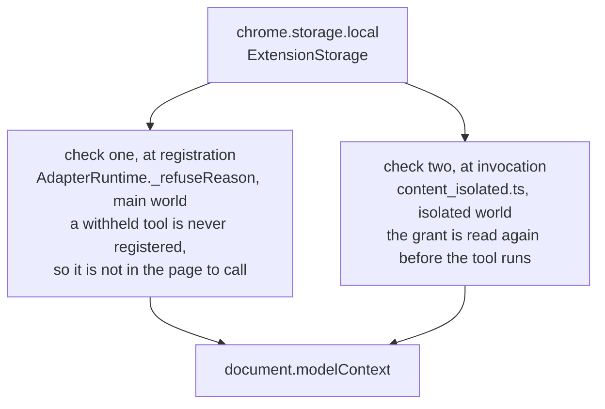

# Permissions, and who decides

On a fresh install an agent gets read-only tools and nothing else. Acting tools stay withheld until a person opts in, for one origin at a time. This document says where that decision is stored, where it is enforced, and how a person changes it.

## What a fresh install looks like

`ExtensionStorage.DEFAULTS` is the whole of it.

```ts
{
	globallyEnabled: true,
	actingAllowedByOrigin: {},
}
```

The extension is on, and no origin has been opted in. Every `readOnly` tool registers; every `acting` and `sensitive` tool is withheld with a reason.

## The two switches

They are kept separate on purpose.

- **`globallyEnabled`** is the kill switch. When it is off, no adapter registers anything anywhere — read-only tools included.
- **`actingAllowedByOrigin`** is the opt-in, keyed by origin. Absent means not allowed.

Collapsing the two would lose the kill switch, because the kill switch has to withdraw read-only tools too. The grant travels into the page as an `OriginGrant` carrying both fields, and the kill switch stays a field of its own for the same reason: collapsing it into `actingAllowed` silently left read-only tools registered.

## Where the decision is enforced

In the extension, and nowhere else. The native messaging host decides nothing about permissions: it forwards to the extension, which is the only place that knows which tabs have adapters and what the user allowed. That matters because the host is the part reachable from outside the browser.

Inside the extension the check happens twice.



The second check is not redundant. The first one makes a withheld tool absent; the second one puts enforcement on the path the agent's request actually travels, so that enforcement does not rest on registration alone.

A `sensitive` tool adds a third check, inside the wrapped handler: `window.confirm` names the tool and the site and asks the user, once per invocation. Declining throws, and the invocation stops there.

## How a person changes it

**From the popup**, opened from the toolbar. It shows which adapter matched the current tab, which tools are live and which are held, and it carries three controls:

- a switch to let agents act on this site, which writes `actingAllowedByOrigin` for that origin;
- the global kill switch;
- a button to clear an injection sighting, when there is one.

Every state a person can change is written through `ExtensionStorage`, never straight to `chrome.storage`, so one file holds the shape of a grant.

**From the command line**, with `npm run grant`. [`tools/grant_acting.ts`](https://github.com/jeromeetienne/webmcp_everywhere/blob/main/tools/grant_acting.ts) writes the same settings object straight into extension storage over the Chrome DevTools Protocol. The popup is the real way to do this; this exists so an unattended verification run can reach the same state, and so a demonstration does not stall waiting for somebody to tick a box. It needs a Chrome launched with a debugging port, so it is a tool for the throwaway profile and not for your everyday browser.

A grant change takes effect immediately. [`content_isolated.ts`](https://github.com/jeromeetienne/webmcp_everywhere/blob/main/src/chrome_extension/page_injection/content_isolated.ts) listens on `chrome.storage.onChanged` and sends the new grant into the page, and `AdapterRuntime` re-registers against it.

## What the user can see

Silence is what turns a small compromise into a large one, so three things are made visible.

- **Every invocation is announced.** The wrapped handler dispatches a `webmcp-everywhere:invocation` event, which the isolated world forwards to the background service worker.
- **Every registration publishes a report.** `AdapterRuntime` publishes a `RuntimeReport` naming what was registered, what was withheld and why, whether the adapter yielded, and any errors. The popup renders it.
- **Every injection sighting is listed**, with the origin, the tool, and what was found. Clearing it is a deliberate click, never a timeout.

## What the user is not asked

Three narrowings mean some questions never have to be put to the user at all.

- **An adapter can never reach the network.** The build refuses one that tries. So no adapter can send what it read anywhere, whatever it was granted.
- **An agent can only open a page some adapter covers.** `webmcp_everywhere__open_page` refuses any other address, and the refusal names the pages that are allowed. An agent that could open any address would be a general browser driver, which is what this project exists not to be.
- **An agent can only close a tab some adapter covers.** A tab no adapter covers is never closed.

## What is not built

There is no registry, no signing, no review pipeline, and no per-tool grant. Adapters are bundled into the build rather than fetched, so this build has no supply chain to attack; a registry and signing arrive with a catalogue, and there is no catalogue yet.
