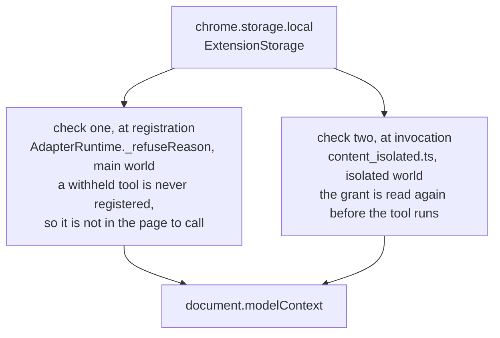

# Permissions, and who decides

On a fresh install an agent gets read-only tools and nothing else. Acting tools stay withheld until a person opts in, for one origin at a time. An adapter written outside this repository runs nothing at all until a person switches it on. This document says where those decisions are stored, where they are enforced, and how a person changes them.

## What a fresh install looks like

`ExtensionStorage.DEFAULTS` is the whole of it.

```ts
{
	globallyEnabled: true,
	actingAllowedByOrigin: {},
	adapterEnabledBySlug: {},
}
```

The extension is on, and no origin has been opted in. Every `readOnly` tool registers; every `acting` and `sensitive` tool is withheld with a reason.

## The three switches

They are kept separate on purpose.

- **`globallyEnabled`** is the kill switch. When it is off, no adapter registers anything anywhere — read-only tools included.
- **`actingAllowedByOrigin`** is the opt-in, keyed by origin. Absent means not allowed.
- **`adapterEnabledBySlug`** says which adapters run at all, keyed by site slug. Absent means the default for that adapter's kind: an adapter bundled into this build is on, and an adapter loaded from a folder is off.

Collapsing the first two would lose the kill switch, because the kill switch has to withdraw read-only tools too. The grant travels into the page as an `OriginGrant` carrying both fields, and the kill switch stays a field of its own for the same reason: collapsing it into `actingAllowed` silently left read-only tools registered.

`adapterEnabledBySlug` is a third switch rather than a fourth state of the second one, because it answers a different question. `actingAllowedByOrigin` asks what an adapter you already run may do on one site. `adapterEnabledBySlug` asks whether that adapter's code runs on your machine at all.

## Which adapter runs where

The extension manifest names no site. Until milestone 3 of [issue #9](https://github.com/jeromeetienne/webmcp_everywhere/issues/9) it named every adapted site three times over, which meant the install asked the user for every site the catalogue covered, the extension store reviewed the extension again for each new site, and a user reinstalled to receive one new adapter. None of that survives a catalogue, so the sites moved into `InjectionRegistrar`, in the background service worker, which decides them when the user switches an adapter on and re-decides them on every `chrome.storage.onChanged`.

A bundled adapter's main-world code is in this extension, so `chrome.scripting.registerContentScripts` registers it. A loaded adapter's code is not in this extension, so `chrome.userScripts` registers it — that is the one interface Chrome offers for running code an extension did not ship.

Two adapters are never registered for one host. The second one is withheld and says which adapter already covers that host.

## Where the decision is enforced

In the extension, and nowhere else. The native messaging host decides nothing about permissions: it forwards to the extension, which is the only place that knows which tabs have adapters and what the user allowed. That matters because the host is the part reachable from outside the browser.

Inside the extension the check happens twice.



The second check is not redundant. The first one makes a withheld tool absent; the second one puts enforcement on the path the agent's request actually travels, so that enforcement does not rest on registration alone.

A `sensitive` tool adds a third check, inside the wrapped handler: `window.confirm` names the tool and the site and asks the user, once per invocation. Declining throws, and the invocation stops there.

## How a person changes it

**From the popup**, opened from the toolbar. It shows which adapter matched the current tab, which tools are live and which are held, and it carries four controls:

- a switch to let agents act on this site, which writes `actingAllowedByOrigin` for that origin;
- the global kill switch;
- one switch per adapter, bundled and loaded alike, which writes `adapterEnabledBySlug`;
- a button to clear an injection sighting, when there is one.

The per-adapter list names every loaded adapter's author and the folder it came from, and says why an adapter is not running when it is not: switched off, another adapter already covers that host, or **Allow User Scripts** is off.

Every state a person can change is written through `ExtensionStorage`, never straight to `chrome.storage`, so one file holds the shape of a grant.

**From the command line**, with `npm run grant`. [`tools/grant_acting.ts`](https://github.com/jeromeetienne/webmcp_everywhere/blob/main/tools/grant_acting.ts) writes the same settings object straight into extension storage over the Chrome DevTools Protocol. The popup is the real way to do this; this exists so an unattended verification run can reach the same state, and so a demonstration does not stall waiting for somebody to tick a box. It needs a Chrome launched with a debugging port, so it is a tool for the throwaway profile and not for your everyday browser.

A grant change takes effect immediately. [`content_isolated.ts`](https://github.com/jeromeetienne/webmcp_everywhere/blob/main/contribs/chrome_extension/page_injection/content_isolated.ts) listens on `chrome.storage.onChanged` and sends the new grant into the page, and `AdapterRuntime` re-registers against it.

## What the user can see

Silence is what turns a small compromise into a large one, so three things are made visible.

- **Every invocation is announced.** The wrapped handler dispatches a `webmcp-everywhere:invocation` event, which the isolated world forwards to the background service worker.
- **Every registration publishes a report.** `AdapterRuntime` publishes a `RuntimeReport` naming what was registered, what was withheld and why, whether the adapter yielded, and any errors. The popup renders it.
- **Every injection sighting is listed**, with the origin, the tool, and what was found. Clearing it is a deliberate click, never a timeout.

## What the user is not asked

Three narrowings mean some questions never have to be put to the user at all.

- **An adapter can never reach the network.** The build refuses one that tries. So no adapter can send what it read anywhere, whatever it was granted.
- **An agent can only open a page some adapter covers.** `webmcp_everywhere__open_page` refuses any other address, and the refusal names the pages that are allowed. An agent that could open any address would be a general browser driver, which is what this project exists not to be.
- **An agent can only close a tab some adapter covers.** A tab no adapter covers is never closed.

## What you agree to when you load an adapter nobody here reviewed

`npm run load-adapter -- <folder>` installs an adapter written by somebody this repository has never met. Read this section before running it.

**You are installing somebody else's code into your own logged-in sessions.** A loaded adapter runs in the page's main world, on the sites its match patterns name, with the page's own privileges and your own cookies. It can read anything on those pages that you can read.

**Nobody reviewed it but you and the checks.** `npm run load-adapter` puts the folder through the same two checks a bundled adapter faces at build time — `AdapterSchema` for its shape and `PermissionAudit` for its source — and prints every tool with its permission class before it installs anything. That is a lint over one file, not a review, and [security_model.md](security_model.md) names exactly what it does and does not catch. Nothing else stands between the folder and your browser.

**It cannot reach the network.** The one check that does not depend on reading source still applies: an adapter that calls `fetch`, `XMLHttpRequest`, `WebSocket`, `EventSource`, `navigator.sendBeacon`, or a dynamic import is refused, and the refusal names the line. So a loaded adapter can read your pages, but it has no way to send what it read anywhere.

**It starts switched off.** Installing an adapter does not run it. `adapterEnabledBySlug` has no entry for it, the default for a loaded adapter is off, and until you switch it on in the popup its scripts are registered nowhere.

**It needs a second, deliberate decision in Chrome.** `chrome.userScripts` — the only interface for running code the extension did not ship — is absent until you turn on **Allow User Scripts** for this extension at `chrome://extensions`. Until then every loaded adapter is withheld and the popup says so. Chrome asks this separately from the install for the same reason this document exists.

**The acting opt-in is unchanged.** A loaded adapter's `acting` and `sensitive` tools are withheld until you opt that origin in, exactly like a bundled adapter's, and a `sensitive` tool still asks you once per invocation.

**The way out is `npm run unload-adapter -- <site slug>`.** Switching an adapter off in the popup stops it running; unloading removes it from `~/.webmcp_everywhere/adapters/` altogether.

## Why the manifest asks for every site

The manifest declares `host_permissions: ["*://*/*"]`, so the install prompt says this extension can read and change data on every site. That is a real cost and it is written here rather than glossed over.

The plan in milestone 3 of [issue #9](https://github.com/jeromeetienne/webmcp_everywhere/issues/9) called for `optional_host_permissions` instead, so a fresh install would ask for nothing and each origin would be requested when the user enabled an adapter for it. That is the better design and it is not what is built. `chrome.permissions.request` needs a user gesture and puts a dialogue on the screen, and neither exists in the headless Chrome every verification runner uses, so an optional host permission can be neither granted nor checked by anything in this repository. Shipping it would have meant shipping a permission path no check ever exercises, which is the failure [the de-risking rule](../CONTRIBUTING.md) exists to prevent.

What the broad permission does **not** do is decide where anything runs. No script is registered for a site until an adapter that covers it is switched on, and the popup lists exactly which sites those are. The permission is what makes that registration possible; `adapterEnabledBySlug` is what makes it happen.

## What is not built

There is no registry, no signing, no review pipeline, and no per-tool grant. An adapter arrives either bundled into this build or from a folder you named yourself, so there is no fetch and no supply chain to attack; a registry and signing arrive with a catalogue, and there is no catalogue yet.
