# Testing and verification

Almost every check drives a real Chrome and asserts against state read back out of a live page. Nothing is mocked, and a check that cannot fail is not a check.

```bash
npm test                # every check, with Chrome hidden
npm run test:visible    # every check, with Chrome on screen
npm run test:no_browser # only the three runners that start no browser
```

The checks are written with `node:test`, which Node.js runs straight from TypeScript with no build step. `npm test` runs them one runner at a time, because every runner that starts a browser takes the same debugging port and the same throwaway profile. Each of those launches its own throwaway Chrome, so none of them needs a browser to be up first.

## The three paths to the browser

Two of the three exist only for checking, and neither is the product.

```mermaid
flowchart TB
	subgraph product["the product path"]
		agent1["an agent"] -->|"HTTP, bearer token"| host["native messaging host"]
		host -->|"native messaging"| ext["the extension"]
		ext --> page1["the page"]
	end
	subgraph bridge["the stdio bridge path — checking only"]
		agent2["an agent"] -->|"standard input and output"| br["webmcp_bridge.ts"]
		br -->|"Chrome DevTools Protocol"| page2["the page, extension bypassed"]
	end
	subgraph direct["the direct path — checking only"]
		runner["a verification runner"] -->|"Chrome DevTools Protocol"| page3["the page"]
	end
```



**The product path** is the native messaging host. It is the only one with a token on it and the only one that goes through the extension, which is the only place that knows what the user has allowed.

**The direct path** is a verification runner driving a page over the Chrome DevTools Protocol, through [`tools/chrome_devtools_protocol/cdp_client.ts`](https://github.com/jeromeetienne/webmcp_everywhere/blob/main/tools/chrome_devtools_protocol/cdp_client.ts). It is how the adapter checks assert against a live page.

**The stdio bridge path** is [`tests/devtools_protocol_bridge/webmcp_bridge.ts`](https://github.com/jeromeetienne/webmcp_everywhere/blob/main/tests/devtools_protocol_bridge/webmcp_bridge.ts), a Model Context Protocol server on standard input and standard output that carries a page's registered WebMCP tools out to an agent. It was the first path that worked, written before the extension and the native messaging host existed, and it is kept because it is the smallest way to tell an adapter fault apart from a delivery fault when `node --test tests/native_host.test.ts` fails.

Both checking paths depend on Chrome's remote debugging port, which is unauthenticated and reachable by every process on the machine. That is fine for a throwaway profile and wrong for anything else, which is why the native messaging host exists.

## The runners

`npm test` runs them all. To run one on its own, pass its path to `node --test`.

```bash
node --test tests/native_host.test.ts
```

| Runner | What it covers |
| --- | --- |
| [`tests/site_adapters/todomvc.test.ts`](https://github.com/jeromeetienne/webmcp_everywhere/blob/main/tests/site_adapters/todomvc.test.ts) | Drives the Playwright TodoMVC page over the Chrome DevTools Protocol |
| [`tests/site_adapters/caniuse.test.ts`](https://github.com/jeromeetienne/webmcp_everywhere/blob/main/tests/site_adapters/caniuse.test.ts) | Drives `https://caniuse.com/` the same way |
| [`tests/site_adapters/openstreetmap.test.ts`](https://github.com/jeromeetienne/webmcp_everywhere/blob/main/tests/site_adapters/openstreetmap.test.ts) | Drives `https://www.openstreetmap.org/` the same way |
| [`tests/native_host.test.ts`](https://github.com/jeromeetienne/webmcp_everywhere/blob/main/tests/native_host.test.ts) | The real delivery path, from the HTTP endpoint through to the page |
| [`tests/endpoint_file.test.ts`](https://github.com/jeromeetienne/webmcp_everywhere/blob/main/tests/endpoint_file.test.ts) | That `endpoint.json` always names a host that is really listening |
| [`tests/native_host_install.test.ts`](https://github.com/jeromeetienne/webmcp_everywhere/blob/main/tests/native_host_install.test.ts) | That installing announces every file first, and that uninstalling removes every one of them |
| [`tests/injection_defence.test.ts`](https://github.com/jeromeetienne/webmcp_everywhere/blob/main/tests/injection_defence.test.ts) | Writes hostile content onto the page and attacks through it |
| [`tests/devtools_protocol_bridge/webmcp_bridge.test.ts`](https://github.com/jeromeetienne/webmcp_everywhere/blob/main/tests/devtools_protocol_bridge/webmcp_bridge.test.ts) | The stdio Model Context Protocol bridge |
| [`tests/source_boundary.test.ts`](https://github.com/jeromeetienne/webmcp_everywhere/blob/main/tests/source_boundary.test.ts) | Refuses any relative import that leaves [`src/`](https://github.com/jeromeetienne/webmcp_everywhere/tree/main/src) |

`npm run typecheck` covers the types, and that every file Node.js runs directly stays within erasable syntax.

## What continuous integration runs

`npm run test:no_browser` names the three runners that start no browser: [`tests/endpoint_file.test.ts`](https://github.com/jeromeetienne/webmcp_everywhere/blob/main/tests/endpoint_file.test.ts), [`tests/native_host_install.test.ts`](https://github.com/jeromeetienne/webmcp_everywhere/blob/main/tests/native_host_install.test.ts), and [`tests/source_boundary.test.ts`](https://github.com/jeromeetienne/webmcp_everywhere/blob/main/tests/source_boundary.test.ts). Those three, plus `npm run typecheck` and `npm run build`, are what [`.github/workflows/checks_without_a_browser.yml`](https://github.com/jeromeetienne/webmcp_everywhere/blob/main/.github/workflows/checks_without_a_browser.yml) runs on every pull request, and they answer in about a minute.

Every other runner drives a real Chrome against a real public site. That is the right way to know an adapter works and the wrong way to answer a pull request: it is slow, it needs Chrome 149 or later with the WebMCP origin trial, and it reports a site that changed the same way it reports a broken adapter. So **running the live check for an adapter is the contributor's job**, and the date it last passed belongs in the pull request. Checking those runners nightly, one job per adapter, so that a stale adapter is visible before a user finds it, is milestone four of [issue #9](https://github.com/jeromeetienne/webmcp_everywhere/issues/9).

## Which one to run when

- **You changed an adapter.** Run that adapter's own runner: `node --test tests/site_adapters/todomvc.test.ts` or `node --test tests/site_adapters/caniuse.test.ts`.
- **You changed the extension or the native messaging host.** Run `node --test tests/native_host.test.ts`, which is the only runner covering the real delivery path.
- **`node --test tests/native_host.test.ts` fails and you cannot tell why.** Run the adapter's own runner. If that passes, the adapter is fine and the fault is in delivery. `node --test tests/devtools_protocol_bridge/webmcp_bridge.test.ts` narrows it further, because the bridge reaches the page without the extension or the host in the way.
- **You touched how the host takes its port, stops, or writes `endpoint.json`.** Run `node --test tests/endpoint_file.test.ts`.
- **You touched what the installation writes into Chrome, or what the uninstallation takes back out.** Run `node --test tests/native_host_install.test.ts`.
- **You touched the framing or the injection watch.** Run `node --test tests/injection_defence.test.ts`.
- **You moved a file between [`src/`](https://github.com/jeromeetienne/webmcp_everywhere/tree/main/src), [`tools/`](https://github.com/jeromeetienne/webmcp_everywhere/tree/main/tools), and [`tests/`](https://github.com/jeromeetienne/webmcp_everywhere/tree/main/tests).** Run `node --test tests/source_boundary.test.ts`.

## The three runners with no browser in them

[`tests/endpoint_file.test.ts`](https://github.com/jeromeetienne/webmcp_everywhere/blob/main/tests/endpoint_file.test.ts), [`tests/native_host_install.test.ts`](https://github.com/jeromeetienne/webmcp_everywhere/blob/main/tests/native_host_install.test.ts), and [`tests/source_boundary.test.ts`](https://github.com/jeromeetienne/webmcp_everywhere/blob/main/tests/source_boundary.test.ts) start no Chrome. The subject of `endpoint_file.test.ts` is the host process and the file it writes, and the fault that hid the longest in that file was a host whose standard input never reached its end — a state a browser cannot be asked for, but a named pipe held open by another process reproduces exactly. Nothing is stood in for. The hosts are the real program, started over a real pipe the way Chrome starts them, holding a real port and writing the real file to a throwaway directory named by `WEBMCP_EVERYWHERE_STATE_DIR`, so the checks never disturb the host you are really using.

What `endpoint_file.test.ts` holds to is one rule: whenever `endpoint.json` is there, the address in it answers, and the process named in it is the process answering. It checks that rule after a second host takes the port from a first, after the host holding the port is stopped, after every host is stopped, after a browser is killed with its host's standard input still open, and while a program that is not a host holds the port.

The subject of `native_host_install.test.ts` is the host manifest file, the one thing this repository writes into a browser you installed. It holds to one rule as well: the installation names every file before it writes any of them, and the uninstallation removes every file the installation could have written, including a manifest left behind by a working copy that has since moved or been deleted. It writes into throwaway user data directories only, and every call it makes passes `isEverydayChromeCovered: false`, so the runner that covers this never does the thing it exists to refuse.

## The import boundary

Imports run one way only.

```
tests/  →  tools/  →  src/
```

[`tests/`](https://github.com/jeromeetienne/webmcp_everywhere/tree/main/tests) may import from [`tools/`](https://github.com/jeromeetienne/webmcp_everywhere/tree/main/tools) and from [`src/`](https://github.com/jeromeetienne/webmcp_everywhere/tree/main/src). [`tools/`](https://github.com/jeromeetienne/webmcp_everywhere/tree/main/tools) may import from [`src/`](https://github.com/jeromeetienne/webmcp_everywhere/tree/main/src). [`src/`](https://github.com/jeromeetienne/webmcp_everywhere/tree/main/src) imports from neither, and `node --test tests/source_boundary.test.ts` refuses any relative import that leaves [`src/`](https://github.com/jeromeetienne/webmcp_everywhere/tree/main/src).

That rule is what keeps build tooling and verification code from drifting back into the product. [`src/`](https://github.com/jeromeetienne/webmcp_everywhere/tree/main/src) holds what ships and nothing else.

One import crosses in the other direction on purpose: [`tools/adapter_validation/validate_all_adapters.ts`](https://github.com/jeromeetienne/webmcp_everywhere/blob/main/tools/adapter_validation/validate_all_adapters.ts) imports the adapter registry from [`src/chrome_extension/`](https://github.com/jeromeetienne/webmcp_everywhere/tree/main/src/chrome_extension). That is [`tools/`](https://github.com/jeromeetienne/webmcp_everywhere/tree/main/tools) reading [`src/`](https://github.com/jeromeetienne/webmcp_everywhere/tree/main/src), which the boundary allows, and it is the only file in that folder reaching into the extension.

## The shape every runner follows

One shape everywhere, so a runner reads the same as every other runner.

- `NodeTest.before` prepares the live browser into a static field, and `NodeTest.after` closes it.
- `NodeTest.describe` carries what a section header used to print.
- A check throws its own message rather than calling `node:assert`, because those messages are what the runner is for. Detail lines go to `t.diagnostic`.
- Checks in one file run in the order written and share one live page, so a check may depend on the one before it. Anything that has to happen between two checks belongs in the `NodeTest.before` of a nested `NodeTest.describe`, never inside a check that does not own it.
- Every runner ends in `.test.ts`, so `node --test` finds it with no file list. A file holding no check, such as [`tests/host_call_types.ts`](https://github.com/jeromeetienne/webmcp_everywhere/blob/main/tests/host_call_types.ts), keeps a plain name.

## Watching it happen

```bash
npm run test:visible
```

`WEBMCP_EVERYWHERE_CHROME_VISIBILITY` decides whether a launched Chrome puts a window on the screen. Hidden is the default and runs Chrome with `--headless=new`, which still installs the extension, still runs the content scripts, and still starts the native messaging host. Any value other than `visible` or `hidden` is refused by name rather than ignored, so a typo fails the run instead of silently showing a window.

## Calling the tools by hand

The Model Context Protocol Inspector starts already pointed at the native messaging host, with the address read from `~/.webmcp_everywhere/endpoint.json` and the token from `~/.webmcp_everywhere/token`.

```bash
npm run mcp:inspector:start
```

```bash
npm run mcp:inspector:stop
```
