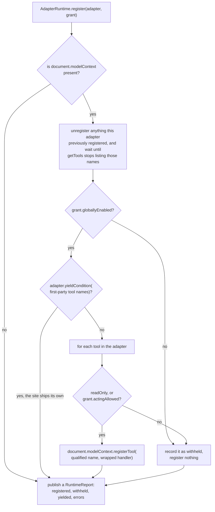
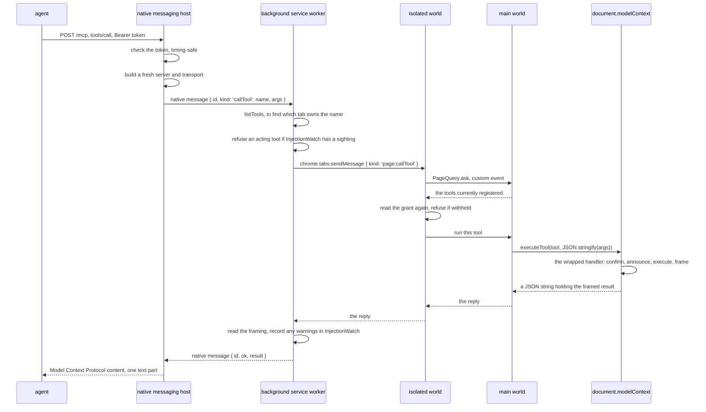

# The life of one tool call

This document follows a single tool call from the agent to the page and back. Everything here happens for every call, including the ones that fail.

Two things happen before any call: the extension connects to the native messaging host, and the adapter registers its tools into the page. Both are described first, because a call needs both to have happened.

## Before anything: the connection

The background service worker calls `NativeBridge.connect`, which opens a native messaging connection with `chrome.runtime.connectNative('com.webmcp_everywhere.host')`. Chrome reads the native messaging host manifest file, starts [`bin/webmcp_native_host.sh`](https://github.com/jeromeetienne/webmcp_everywhere/blob/main/bin/webmcp_native_host.sh), and connects the two.

The host starts a `NativeMessagingCodec` over standard input and standard output, starts an HTTP server, and writes the port it got and the bearer token it expects to `~/.webmcp_everywhere/endpoint.json`.

If the connection cannot be opened, or is later lost, `NativeBridge` schedules a reconnection. When the extension goes away for good, the host sees its channel close and exits.

## Before anything: registration

[`content_main.ts`](https://github.com/jeromeetienne/webmcp_everywhere/blob/main/src/chrome_extension/page_injection/content_main.ts) runs in the page's main world at `document_start`. It asks `AdapterRegistry.findForUrl(window.location.href)` for the adapter covering this page. If none covers it, nothing else happens.

It then asks the isolated world for the user's grant, because the main world cannot read extension storage. [`content_isolated.ts`](https://github.com/jeromeetienne/webmcp_everywhere/blob/main/src/chrome_extension/page_injection/content_isolated.ts) reads `ExtensionStorage.grantForOrigin(window.location.origin)` and sends the grant back as a plain object on a custom Document Object Model event.

`AdapterRuntime.register` then decides what may be registered.

Three things in that diagram are worth naming.

- **The yield condition.** `yieldCondition` receives the names of tools already registered on the page by somebody other than this extension. Returning `true` makes the runtime stand down and register nothing, so a site that ships its own WebMCP tools is never shadowed by an adapter.
- **Unregister and settle.** Re-registration aborts the previous `AbortController` and then waits until `getTools` stops listing those names before registering again. Registering before the old names have gone made a tool abort its own call part way through.
- **The wrapped handler.** No adapter's `execute` is registered directly. `AdapterRuntime._wrapExecute` wraps it, so that a `sensitive` tool asks the user with `window.confirm` first, every invocation is announced on a custom Document Object Model event, and whatever comes back passes through `UntrustedContent.frame`. The wrapping is in the runtime rather than in each adapter so no author can forget it and no hostile adapter can skip it.

Registration runs again when the grant changes, and when the page navigates within the same document — but only when the matching adapter actually changes. Re-registering on every fragment change made a tool abort its own call part way through.

## The call

### At the native messaging host

Every request carries a bearer token in an `Authorization: Bearer` header, compared with `Crypto.timingSafeEqual`. Without it the host answers 401. The one unauthenticated path is `/health`, which reports only whether the extension is connected.

Only `POST /mcp` is served, because the host is stateless. A fresh Model Context Protocol server and a fresh `StreamableHTTPServerTransport` are built for every request: a single shared stateless transport serves exactly one request and then answers 500 to everything after it, which looks to a client like the host crashed.

The host forwards the call to the extension as a native message with an identifier, and waits for an answer carrying the same identifier. If none arrives within twenty seconds it fails with "the extension did not answer in time".

Standard output belongs entirely to the native messaging channel. One stray line of ordinary output corrupts the stream and Chrome closes the connection with no useful error, so everything the host says goes through `WebmcpNativeHost._log`, which writes to standard error and to `~/.webmcp_everywhere/host.log`.

### At the background service worker

`NativeBridge.callTool` first calls `NativeBridge.listTools` to find which tab owns the name the agent used. That is how a name maps back to a tab — see [tool_naming_and_tab_identity.md](tool_naming_and_tab_identity.md).

If the tool is not read-only and `InjectionWatch` holds any sighting, the call is refused outright with a message naming what was seen. Reading keeps working. Why the rule is this blunt is in [security_model.md](security_model.md).

### At the isolated world

[`content_isolated.ts`](https://github.com/jeromeetienne/webmcp_everywhere/blob/main/src/chrome_extension/page_injection/content_isolated.ts) asks the main world for the tools currently registered, refuses a name that is not among them, and then reads the grant a second time. The first check happened at registration; this is the check on the path the agent's request actually travels, so enforcement does not rest on registration alone.

### At the main world

[`content_main.ts`](https://github.com/jeromeetienne/webmcp_everywhere/blob/main/src/chrome_extension/page_injection/content_main.ts) looks the tool up by name inside the page and calls `document.modelContext.executeTool(tool, JSON.stringify(args))`.

Two details of Chrome 151 are load-bearing here. Input is passed as a JSON string, not as an object: Chrome rejects a plain object with `UnknownError: Failed to parse input arguments`, whatever the specification's WebIDL says. And a `RegisteredTool` carries a live `window` reference, so it cannot be moved out of the page — the lookup has to happen inside it.

### The framing on the way back

Every result passes through `UntrustedContent.frame` inside the wrapped handler, which returns a `FramedResult`: a `webmcpEverywhere` object carrying the origin, the tool name, a notice telling the agent this is data rather than instruction, and any warnings; and a `data` field holding the tool's actual result.

The background service worker reads that framing back off the result with `NativeBridge._asFramed` and records any injection warnings in `InjectionWatch`. `executeTool` returns a JSON string, so reading `.webmcpEverywhere` straight off the result silently finds nothing and leaves the watch unarmed — hence the helper.

## How a failure is reported

A thrown handler error does not reach the agent. Chrome 151 replaces a thrown handler error with a fixed `UnknownError` text, so a message thrown from inside a tool is lost. This is why an adapter that cannot serve a reasonable request returns a refusal object naming the tool to call next, rather than throwing.

Failures further out do carry their message. A refusal from the extension, a tab that stopped answering, or a name no tab offers all come back as an error the host turns into a Model Context Protocol result with `isError: true` and the text of the failure.
