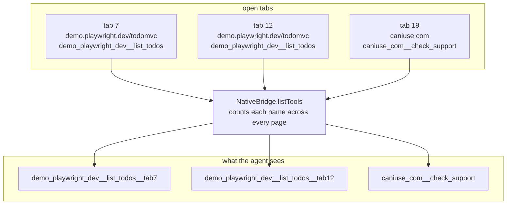

# Tool names, and telling two tabs apart

An agent sees one flat list of tool names. Behind that list are several adapters, several open tabs, and possibly two tabs on the same site. A name has to survive all of that and still lead back to exactly one place. This document says how a name is built, in three stages.

## Stage one: the adapter writes an unqualified name

An adapter names its tools in plain `snake_case`, unique only within that adapter: `list_todos`, `add_todo`, `check_support`. The name never has to be globally unique, because the adapter author cannot know what other adapters exist.

`AdapterSchema` requires the name to match `ToolNaming.VALID_NAME`, which is `^[a-z0-9_]+$`. Anything else is rejected before the build will bundle the adapter.

## Stage two: the runtime qualifies it with the site slug

Every adapter carries a `siteSlug`, a `snake_case` slug derived from its origin. `ToolNaming.slugFromOrigin` builds one: it drops the scheme and any port, then replaces every run of non-alphanumeric characters with a single underscore.

- `https://demo.playwright.dev` becomes `demo_playwright_dev`
- `https://caniuse.com` becomes `caniuse_com`

`AdapterRuntime.register` registers the qualified name, built by `ToolNaming.qualify`, which joins the two halves with two underscores.

```
demo_playwright_dev  +  __  +  list_todos  =  demo_playwright_dev__list_todos
```

The separator is two underscores so that single ones stay free for ordinary `snake_case` inside either half. `ToolNaming.unqualify` splits on the first occurrence, and `ToolNaming.belongsTo` tests whether a qualified name belongs to a given adapter.

Two sites that both want a `search` tool depend on this. Without it the agent would call whichever one happened to register first.

The build checks the result: `ValidateAllAdapters` builds every qualified name across every adapter in the registry and rejects the build if two adapters produce the same one.

## Stage three: the bridge adds a tab suffix, but only when it must

The first two stages happen inside one page. The third happens in the background service worker, which sees every tab at once.

`NativeBridge.listPages` walks every open tab, keeps the ones some adapter in `AdapterRegistry` covers, and asks each of them for the tools it currently has registered. Tabs that do not answer are left out rather than failing the whole call.

`NativeBridge.listTools` then counts how many pages offer each name. A name offered by exactly one page is exposed unchanged. A name offered by two or more pages gains a tab suffix — **in every one of them, never in only one**.



Suffixing both is deliberate. Suffixing only the second one would leave the bare name meaning "whichever tab came first", which is a silent choice made on the agent's behalf. Suffixing both makes the ambiguity visible: the agent can see there are two candidates and has to pick one.

The exposed description carries the page title, or the address when there is no title, so an agent choosing between two suffixed names has something to choose on. `webmcp_everywhere__list_pages` reports the same mapping in full, which is what it exists for.

## How a name leads back to a tab

`NativeBridge.callTool` calls `listTools` again and finds the entry whose `exposedName` matches what the agent used. That entry carries both the `tabId` and the `pageName` — the name as the page knows it, without any tab suffix. The call is sent to that tab under that name.

So the suffix exists only between the background service worker and the agent. Nothing inside a page ever sees it.

## Why the list is rebuilt every time

Neither `listPages` nor `listTools` caches anything. Every `tools/list` and every `tools/call` walks the tabs again and asks each page again.

An adapter registers and withdraws tools as the page changes — the Can I use... adapter's tools depend on which feature the page is showing, and the TodoMVC adapter re-registers when the grant changes. A cached list would show an agent tools that are no longer there, and hide ones that have appeared.

## The three tools that belong to no page

`webmcp_everywhere__list_pages`, `webmcp_everywhere__open_page`, and `webmcp_everywhere__close_page` are about the browser rather than about any one page. They carry the `webmcp_everywhere` slug, they are declared in `WebmcpNativeHost.BUILT_IN_TOOLS` on the host side, and they are answered by `NativeBridge` on the extension side. Because the names are written in both places, a name added in one has to be added in the other.

They are offered before the page tools so an agent that has never used this host reads them first, and finds out that a page it needs can be opened rather than only used when it happens to be open.
